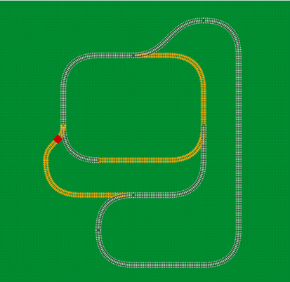

# 🛤️ RailRoad 🚂

Just a simple simulation of a railroad with trains moving along the path.

In general, it was started as a test of the CSS animation on the SVG path.
And since I had a lot of fun with it, I decided to make it a little more complex.
As long as you want to have more control over the animations (speed, direction, switchers), JavaScript (TypeScript) is the way to go.

### Live demo ###

[https://bigismall.github.io/railroads/](https://bigismall.github.io/railroads/)

## Motivation ##

* SVG illustrated guide: <https://css-tricks.com/svg-path-syntax-illustrated-guide/>

## Assets ##

Assets used in this project come from the external asset pack **Top-down Tanks Remastered** by Kenney Vleugels ([Kenney.nl](https://kenney.nl)).

They are licensed under [Creative Commons Zero (CC0)](http://creativecommons.org/publicdomain/zero/1.0/). They may be used in personal and commercial projects. Attribution to Kenney or [www.kenney.nl](https://www.kenney.nl) is appreciated but not required.

## TODO ##

Still many things [TODO](TODO.md)...
