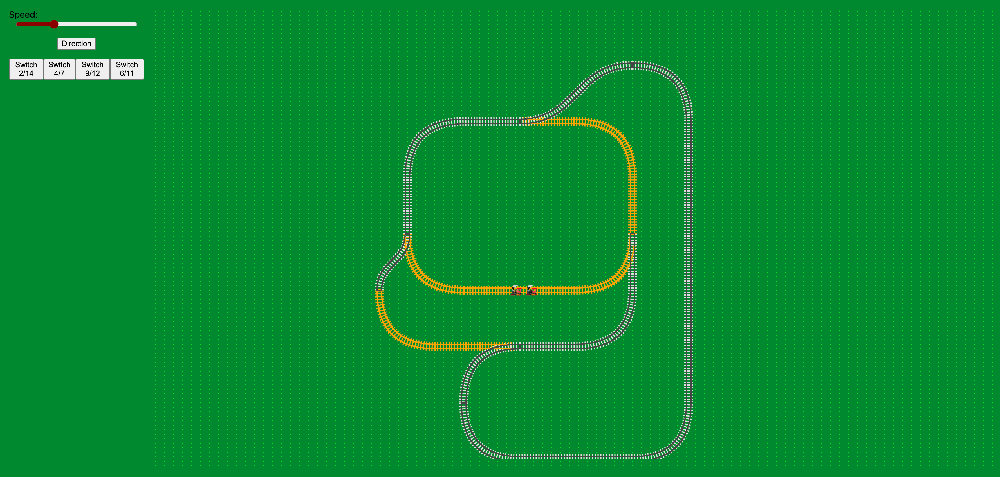

# 🛤️ RailRoad 🚂

Just a simple simulation of a railroad with trains moving along the path.

In general, it was started as a test of the CSS animation on the SVG path. 
And since I had a lot of fun with it, I decided to make it a little more complex.
As long as you want to have more control over the animations (speed, direction, switchers), JavaScript (TypeScript) is the way to go.

### Live demo ###
[https://bigismall.github.io/railroads/](https://bigismall.github.io/railroads/) 

## Motivation ##

* SVG illustrated guide: https://css-tricks.com/svg-path-syntax-illustrated-guide/

## TODO ##
Still many things [TODO](TODO.md)...